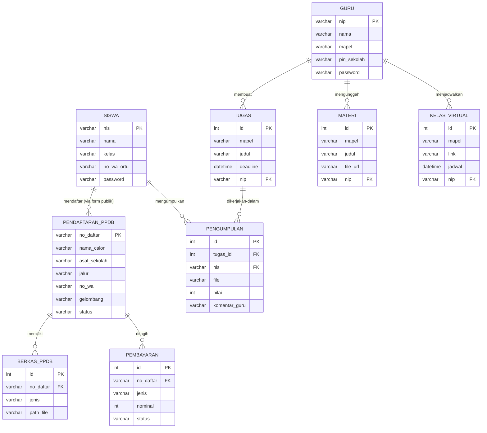
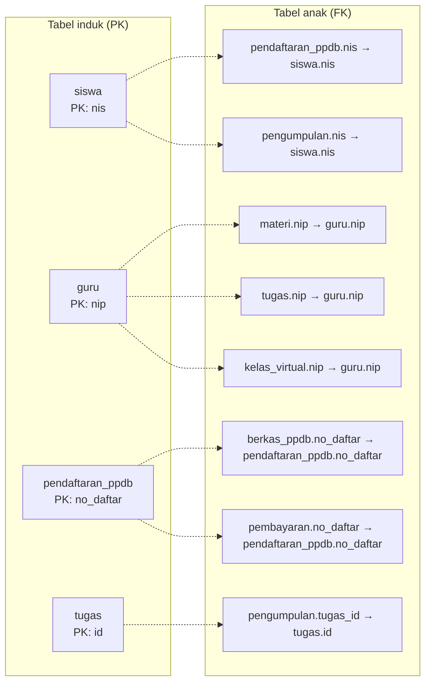
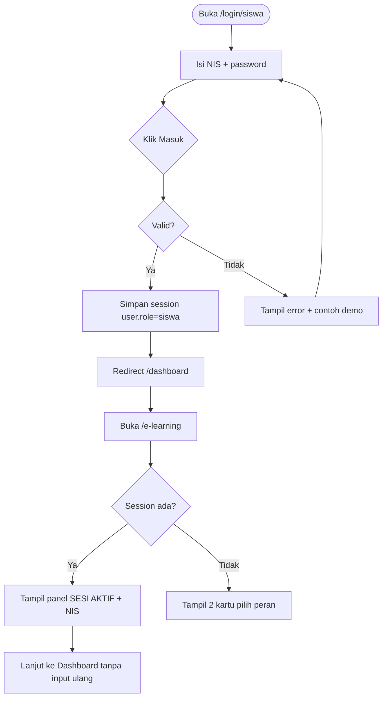
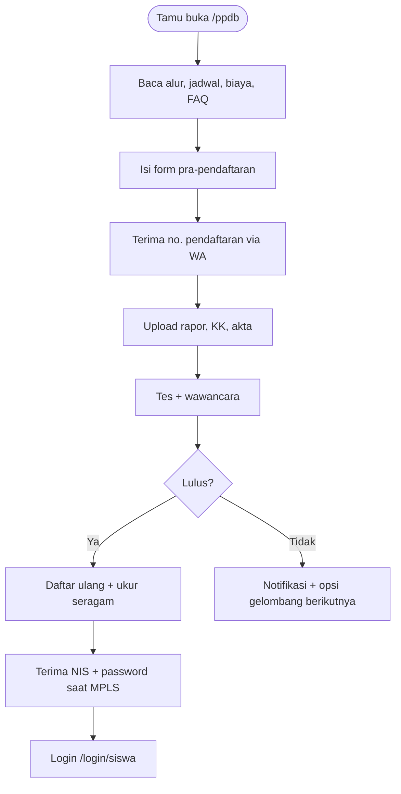
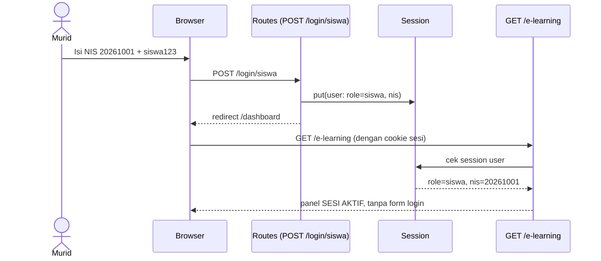
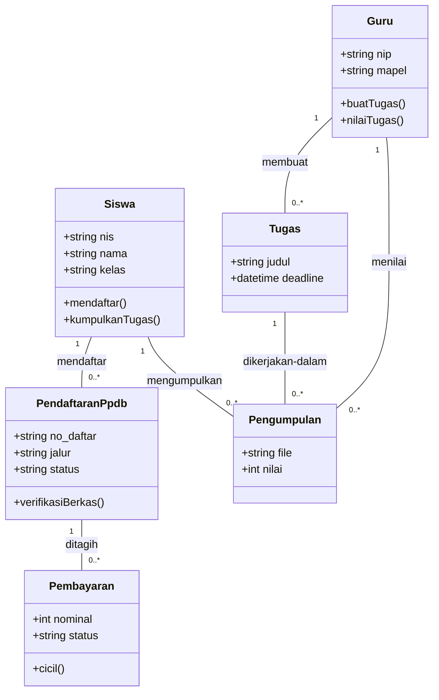

# ERD, LRS & UML — Portal SMA Santo Paulus

Dokumen ini memetakan web yang sudah diimplementasi:
Beranda (`/`), PPDB (`/ppdb`), Login peran (`/login`, `/login/siswa`, `/login/guru`),
Dashboard privat (`/dashboard`, middleware `auth.gate`), E-Learning single-session (`/e-learning`).

Semua blok `mermaid` di bawah langsung tampil sebagai gambar di GitHub / mermaid.live.
Versi teks DBML bisa ditempel ke dbdiagram.io.

---

## 1. ERD (Entity Relationship Diagram)

### 1.1 Daftar entitas (dari fitur nyata)

| Entitas | Atribut (*PK*, *FK*) | Sumber fitur |
|---|---|---|
| `siswa` | *nis*, nama, kelas, no_wa_ortu, password | Login murid, dashboard, pengumpulan tugas |
| `guru` | *nip*, nama, mapel, pin_sekolah, password | Login guru (NIP+PIN), penilaian, bank soal |
| `pendaftaran_ppdb` | *no_daftar*, nama_calon, asal_sekolah, jalur, no_wa, gelombang, status | Form pra-pendaftaran `/ppdb#formulir` |
| `berkas_ppdb` | *id*, no_daftar *FK*, jenis, path_file | Upload rapor, KK, akta, foto |
| `pembayaran` | *id*, no_daftar *FK*, jenis, nominal, status | Uang pangkal (cicil 3x), SPP |
| `materi` | *id*, mapel, judul, file_url, nip *FK* | Materi 24/7 di E-Learning |
| `tugas` | *id*, mapel, judul, deadline, nip *FK* | Tugas online + deadline |
| `pengumpulan` | *id*, tugas_id *FK*, nis *FK*, file, nilai, komentar_guru | Kumpul tugas + nilai real-time |
| `kelas_virtual` | *id*, mapel, link, jadwal, nip *FK* | Jadwal Zoom/Meet H-30 menit |

### 1.2 Diagram (Mermaid — tempel ke mermaid.live / GitHub)



### 1.3 Versi DBML (untuk dbdiagram.io)

```dbml
Table siswa {
  nis varchar [pk]
  nama varchar
  kelas varchar
  no_wa_ortu varchar
  password varchar
}
Table guru {
  nip varchar [pk]
  nama varchar
  mapel varchar
  pin_sekolah varchar
  password varchar
}
Table pendaftaran_ppdb {
  no_daftar varchar [pk]
  nama_calon varchar
  asal_sekolah varchar
  jalur varchar
  no_wa varchar
  gelombang varchar
  status varchar
}
Table berkas_ppdb {
  id int [pk, increment]
  no_daftar varchar [ref: > pendaftaran_ppdb.no_daftar]
  jenis varchar
  path_file varchar
}
Table pembayaran {
  id int [pk, increment]
  no_daftar varchar [ref: > pendaftaran_ppdb.no_daftar]
  jenis varchar
  nominal int
  status varchar
}
Table materi {
  id int [pk, increment]
  mapel varchar
  judul varchar
  file_url varchar
  nip varchar [ref: > guru.nip]
}
Table tugas {
  id int [pk, increment]
  mapel varchar
  judul varchar
  deadline datetime
  nip varchar [ref: > guru.nip]
}
Table pengumpulan {
  id int [pk, increment]
  tugas_id int [ref: > tugas.id]
  nis varchar [ref: > siswa.nis]
  file varchar
  nilai int
  komentar_guru varchar
}
Table kelas_virtual {
  id int [pk, increment]
  mapel varchar
  link varchar
  jadwal datetime
  nip varchar [ref: > guru.nip]
}
```

---

## 2. LRS (Logical Record Structure)

Aturan pakai: setiap entitas ERD menjadi satu kotak tabel;
relasi 1-N diwujudkan sebagai **foreign key di sisi N**
(panah menunjuk ke primary key tabel induk).



**Bacaan cepat (untuk laporan):**

1. `pendaftaran_ppdb.nis` → `siswa.nis` (pendaftar yang sudah jadi siswa dikaitkan via NIS; pendaftar baru murni tercatat di `pendaftaran_ppdb` tanpa akun login).
2. `berkas_ppdb.no_daftar`, `pembayaran.no_daftar` → `pendaftaran_ppdb.no_daftar`.
3. `materi.nip`, `tugas.nip`, `kelas_virtual.nip` → `guru.nip`.
4. `pengumpulan.tugas_id` → `tugas.id`, `pengumpulan.nis` → `siswa.nis`.
5. Tidak ada relasi M-N murni, sehingga **tidak perlu tabel relasi tambahan**.

---

## 3. UML

### 3.1 Use Case Diagram

Aktor = peran nyata di web. `Tamu` tidak butuh login;
`Murid`/`Guru` login sekali di `/login/...` lalu sesi dipakai di `/dashboard` dan `/e-learning`.

```mermaid
usecaseDiagram
    actor Tamu
    actor Murid
    actor Guru
    Tamu --> (Lihat Beranda & Profil)
    Tamu --> (Lihat Info & Formulir PPDB)
    Tamu --> (Pilih Peran Login)
    Murid --> (Login NIS + Password)
    Guru --> (Login NIP + Password + PIN)
    Murid --> (Buka Dashboard Murid)
    Guru --> (Buka Dashboard Guru)
    Murid --> (Akses E-Learning tanpa login ulang)
    Guru --> (Akses E-Learning tanpa login ulang)
    Guru --> (Nilai Tugas & Kelola Bank Soal)
    Murid --> (Kumpulkan Tugas & Ikut CBT)
    Murid --> (Keluar / Ganti Akun)
    Guru --> (Keluar / Ganti Akun)
```

### 3.2 Activity Diagram — Login single-session (murid)



Activity guru identik, hanya inputnya NIP + password + PIN (`/login/guru`).

### 3.3 Activity Diagram — Alur PPDB calon murid (tanpa akun)



### 3.4 Sequence Diagram — Login murid lalu buka E-Learning



### 3.5 Class Diagram (rancangan model Laravel)



---

## 4. Cara membuat / mengedit sendiri

| Diagram | Tool gratis | Langkah |
|---|---|---|
| ERD + LRS | dbdiagram.io | Tempel blok DBML §1.3 → Export PNG |
| Semua UML di atas | mermaid.live | Tempel blok `mermaid` → Export SVG |
| Versi manual rapi | draw.io (diagrams.net) | Entity = rectangle, relasi = connector dengan label 1-N |

Nama tabel/kolom di atas disamakan dengan rencana migration Laravel
(`nis`, `nip`, `no_daftar`, `tugas_id`) agar bisa langsung dipakai saat membuat `php artisan make:model`.
